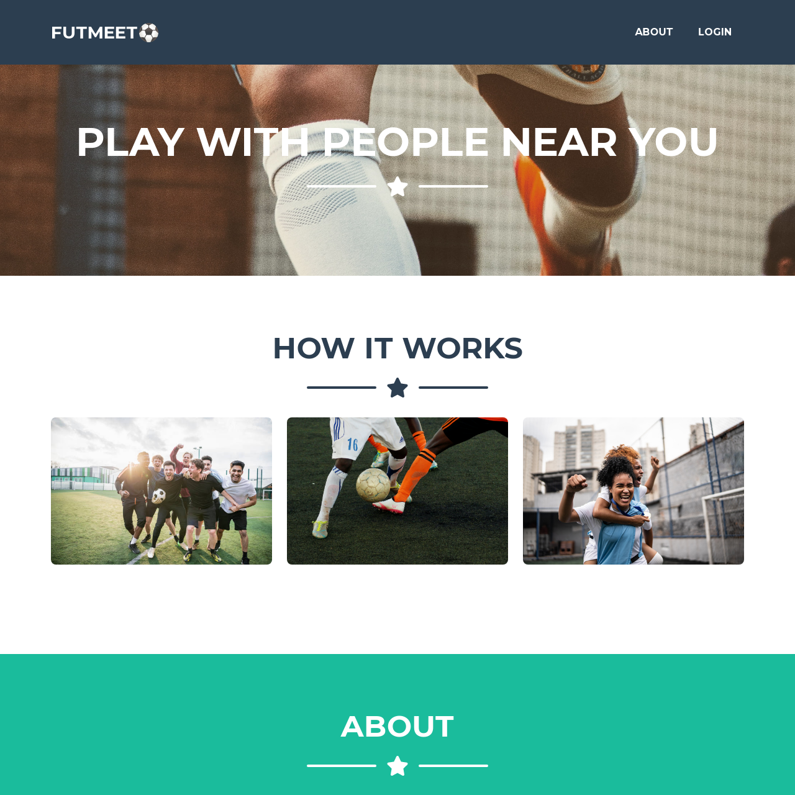

# FUTMEET
Full Stack Soccer Meetup Website with Auth

**Link to project:** https://futmeet.herokuapp.com/

## How It's Made:

**Tech used:** EJS, BootStrap, Node.js, Express.js, MongoDB

I built this full-stack website with the idea of creating a site where local amateur soccer players can meet anywhere and play whenever. Soccer is one of my favorite sports, and have always find it hard to find people to play with. 

## Optimizations

Needed optimizations: 
- Make event form responsive
- Add map to event finder page
- Add another layer of security to event sign up

## Lessons Learned:

- How to organize my website using MVC structure
- How to build and deploy a full stack application
- How to use set up views with EJS
- Routing with express 
- How to save data in a mongodb database
- Authentication with Passport

